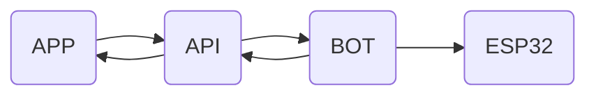
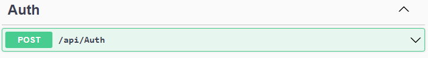

# API Moisés

Created time: December 30, 2022 12:13 PM
Last edited time: January 2, 2023 8:41 AM
Status: Caminhando
Type: Post

> Projeto desenvolvido como Trabalho de Conclusão de Curso (TCC) para o curso de Engenharia de Controle e Automação e apresentado em outubro de 2022
> 

# Overview do projeto Moisés

# Objetivo

<aside>
🔎 Aplicação backend responsável por garantir a disponibilidade das informações pertinentes ao Sitema Moisés

</aside>

# API Moisés

Nossa api é responsável pela padronização dos dados recebidos para realização e cumprimento das regras do negócio, bem como da disponibilização dos recursos armazenados por outras partes do sistema, como o [front](https://github.com/nicolas-souza/Moises_WebApp) e o chat-bot 

<aside>
✅ Para implementar esse projeto e rodar o serviço é necessário utilizar um banco de dados e aplicar as migrações do Entity Framework, para criar o banco de dados de maneira adequada.

</aside>

# Controllers

## Auth

## Reservas

## Usuarios

# Próximos Passos

- Melhorar a autenticação do sistema
    - Atualimente é feita via parâmetros de rota o que claramente não é a melhor forma 👀
- Implementar um padrão de arquitetura
- Melhorar os modelos de dados

# Repositórios

[https://github.com/nicolas-souza/Moises_Api](https://github.com/nicolas-souza/Moises_Api)

[https://github.com/nicolas-souza/Moises_WebApp](https://github.com/nicolas-souza/Moises_WebApp)